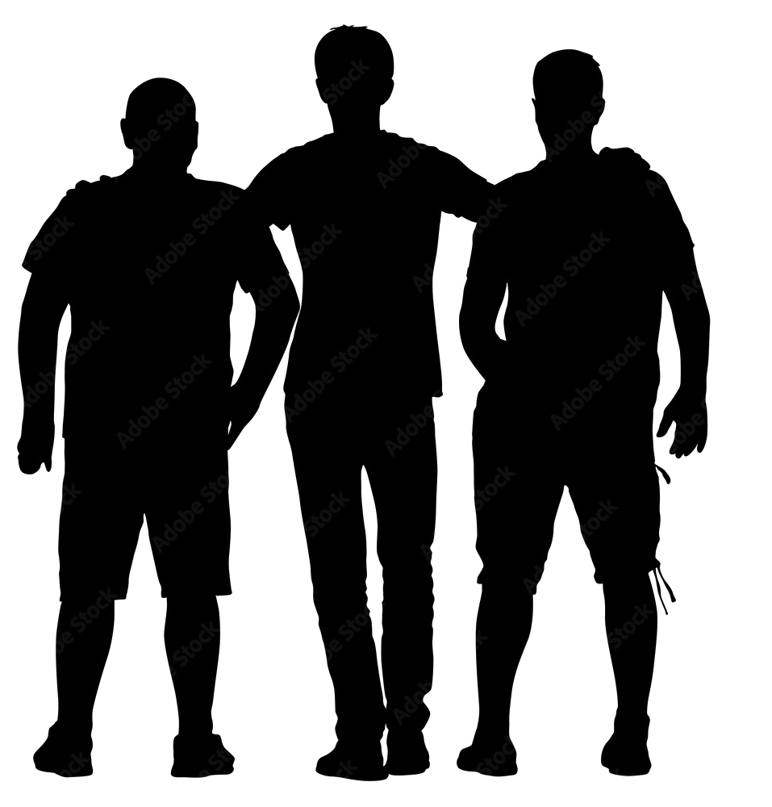

# Paz-Justicia-Instituciones
HackFest 2022 URL xela
Bienvenidos al repositorio donde se guardara el proyecto realizado en HTML. 
Welcome to the repository where the project made in HTML will be saved.
 

Este proyecto salio de una idea de la Universidad Rafael Landivar, en cual a nostros como estdudiantes fue como una motivacion a particpiar en ella. Ya que queriamos aprender a como es que funcionan las paginas web, además de como implementar las funciones que tienen estos editores web. Ademas fue algo entretenido aprender lo que fue la implementacion de estos codigos y como es que reaccionaban a la pagina. Tambien que este programa es responsive, esto quiere decir que se adapata a cualquier pantalla en la que se observe. Gracias a la plataforma visual code que es donde alojamos el codigo que nuestros frameworks tienen, como el CSS y el HTML. 

This project came out of an idea from the Rafael Landivar University, in which we as students were motivated to participate in it. Since we wanted to learn how web pages work, as well as how to implement the functions that these web editors have. It was also quite entertaining to learn what was the implementation of these codes and how they reacted to the page. Also that this program is responsive, this means that it adapts to any screen in which it is observed. Thanks to the visual code platform, which is where we host the code that our frameworks have, such as CSS and HTML. 

# HackFest 2022 URL Xela 

<!-- Tabla de contenidos -->

## Grupo
<h1>FLMB</h1>

| Miembro | Carnet |
| ----------- | ----------- |
| Mariano Gutierrez |  1535719  |
| Fernando Quiñones | 1518619   |
| Marco Javier de Leon | 1521719   |

Fotos de los contribuidores de este proyecto.  
https://drive.google.com/file/d/1xqnn9o1FDOx9sIerP9PqHR9DYuj3Ffme/view?usp=sharing
https://drive.google.com/file/d/1cMCiA8k6UNp_CrQhWBWQFscLKsTsmLHo/view?usp=sharing

(<a href="#top">Regreso al inicio</a>)

## Sobre el Proyecto

Es un proyecto sobre una pagina de los Objetivos de la Agenda de Desarrollo Sostenible de la ONU. Es mas que todo una pagina informativa donde esta explicado este objetico el cual es el numero 16, además de algunas instituciones que se pueden relacionar con este. El cual las herramientas fueron de mucha ayuda con la realizacion de este proyecto y tambien fue de gran ayuda entender lo que fue trabajar con estos pues son herramientas que tienen diferentes funciones y ademas que tienen diferentes herramientas que son facil al interactuar.   

It is a project on a page of the Goals of the UN Sustainable Development Agenda. It is more than all an informative page where this objective is explained, which is number 16, in addition to some institutions that can be related to it. Which tools were very helpful with the realization of this project and it was also very helpful to understand what it was like to work with these because they are tools that have different functions and also have different tools that are easy to interact with.

#### Frameworks:

  

#### IDE y Herramientas:

;

 

(<a href="#top">Regreso al inicio</a>)

### Tema de la Página

#### Paz, Justicia e Instituciones Solidas:
Promover sociedades pacíficas e inclusivas para el desarrollo sostenible, facilitar el acceso a la justicia para todos y crear instituciones eficaces, responsables e inclusivas a todos los niveles. Tambien para lograrlo cuenta con varios obstaculos ya que siempre habran y surgiran nuevos problemas el cual esto hace que el objetivo se extienda mas y mas, y cada dia se ve mas lejos alcanzar esa meta que han puesto. Cada dia la sociedad se vuelve en violencia, corrupcion y el racismo, porque no saben como manejar o tratar de alejar esos problemas. Para ello se necesita de un voluntad fuerte, para no dejarse atrapar de esta sustancia que es dañina para la humanidad y para ello hemos pensado que un tema bueno seia la inclusion en la sociedad y poco a poco se abanza con el lema de "PROMOVER SOCIEDADES JUSTAS, PACÍFICAS E INCLUSIVAS".
 
<h2>INGLES</h2>
Promote peaceful and inclusive societies for sustainable development, facilitate access to justice for all and create effective, accountable and inclusive institutions at all levels. Also to achieve it, it has several obstacles since there will always be and new problems will arise, which makes the objective extend more and more, and every day it is further away to reach that goal that they have set. Every day society turns to violence, corruption and racism, because they don't know how to handle or try to get rid of these problems. For this, a strong will is needed, not to be trapped by this substance that is harmful to humanity and for this we have thought that a good issue would be inclusion in society and little by little it is advanced with the motto "PROMOTE SOCIETIES FAIR, PEACEFUL AND INCLUSIVE."

  

(<a href="#top">Regreso al inicio</a>)

## Página
[Link](https://paz-justica-e-instiruciones.netlify.app/)

## Wiki del repositorio
[Link](https://github.com/agentepeke/Paz-Justicia-Instituciones/wiki)

(<a href="#top">Regreso al inicio</a>)

